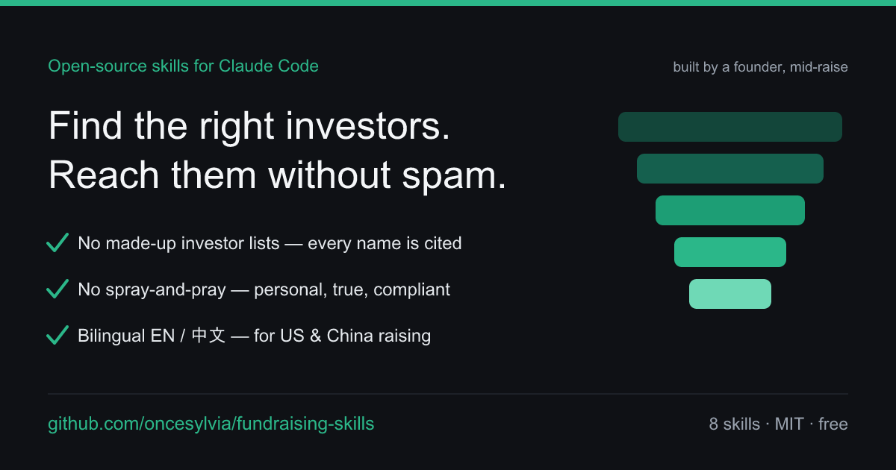

# Fundraising Skills



A small, **honest** toolkit for founder-led fundraising, built as
[Claude Code](https://claude.com/claude-code) Skills.

Most fundraising advice fails founders at two points: **finding the right
investors** for their stage and sector, and **reaching out** without sounding
like spam. These skills help with both — and they're built to refuse the two
things that quietly wreck a raise: **hallucinated investor lists** and
**spray-and-pray outreach**.

> Built for the US / Silicon Valley fundraising playbook, but the frameworks
> work globally. All investor research is done **live, from free public
> sources** — no paid databases, no made-up names.

## The fundraising funnel → which skill helps

```
  ⓪ Sharpen      ① Find & qualify       ② Find the person      ③ Reach out            ④ Run it
 ┌────────────┐ ┌────────────────────┐ ┌───────────────────┐ ┌──────────────────────┐ ┌──────────────────┐
 │ pitch-     │→│ investor-targeting │→│ warm-path-finder  │→│ warm-intro (best)    │→│ pipeline-tracker │
 │ narrative  │ │ investor-research  │ │ which human +     │ │ cold-email (no path) │ │ track + follow up│
 └────────────┘ └────────────────────┘ │ who can intro me  │ │ cold-call (on calls) │ └──────────────────┘
                                        └───────────────────┘ └──────────────────────┘
```

A **warm intro beats the best cold email** — if a path exists, start there.

## Is this for you? / 这套适合你吗?

**Use it if 👇 / 符合以下就用得上:**

| ✅ | English | 中文 |
|---|---|---|
| | Raising pre-seed / seed / Series A, doing **founder-led** outreach yourself | 自己在跑 pre-seed / 种子 / A 轮募资 |
| | You want the *right* investors for your stage & sector — not a giant list | 想找**对的**投资人,不是一份群发大名单 |
| | US / global **or** China market (bilingual; WeChat / FA / BP playbook inside) | 中美市场都覆盖(微信 / FA / BP 打法都有) |
| | You'll reach out honestly — personalized, truthful traction, no spam | 愿意一对一真诚触达、不夸大、不群发 |
| | You have an AI agent (Claude Code) and want fundraising *as a capability* | 想把募资变成 agent 的**能力**,而不是读一篇干货 |

**Maybe skip it if 👇 / 这些情况可能不需要:**

| ❌ | English | 中文 |
|---|---|---|
| | A banker / FA is running your entire raise for you | 全程有 FA / 投行代跑,不用自己动手 |
| | You just want to mass-blast thousands of investors (this **refuses** that) | 只想群发几千封(这套会**拒绝**) |
| | You're past Series B / growth stage | 已过 B 轮 / 成长期 |

**What you bring:** your raise details (stage, sector, traction) + optionally your
own authorized contacts (an exported LinkedIn CSV, or — for China founders — a
[focused contact sheet](skills/warm-path-finder/references/contact-sheet-template.csv)).
**你需要准备:** 你的募资信息(轮次/赛道/牵引力)+(可选)你自己授权的联系人
(领英导出 CSV,或中国创始人用[聚焦联系人表](skills/warm-path-finder/references/contact-sheet-template.csv))。

## Skills

| Skill | Use it when… | What you get |
|---|---|---|
| **[pitch-narrative](skills/pitch-narrative/SKILL.md)** | Your story is fuzzy (do this first) | A sharp one-liner, 30-sec elevator pitch, and a 6-beat round narrative the others reuse |
| **[investor-targeting](skills/investor-targeting/SKILL.md)** | "Who should I raise from?" | A tiered (A/B/C) target list, each with a fit reason, **source link**, and confidence flag — researched live, never invented |
| **[investor-research](skills/investor-research/SKILL.md)** | Before reaching out or taking a meeting | A fact-checked one-page profile of one investor: thesis, recent checks, right partner, conflicts, red flags, smart questions to ask |
| **[warm-path-finder](skills/warm-path-finder/SKILL.md)** | "Who do I actually talk to, and who can intro me?" | The specific partner/senior IM who owns your deal, + ranked warm-connection paths mined from your **own authorized data** (Gmail, exported LinkedIn connections, contacts) and public sources |
| **[warm-intro](skills/warm-intro/SKILL.md)** | You have a mutual connection | A forwardable double opt-in intro, the no-pressure ask to your connector, and the etiquette to not burn the relationship |
| **[cold-email](skills/cold-email/SKILL.md)** | You have a fit but no warm path | A short, personalized email + 2 subject lines + a polite follow-up sequence |
| **[cold-call](skills/cold-call/SKILL.md)** | You have a live or first call | A 30-sec opener, narrative beats, an objection bank, a voicemail script, and a clean closing ask |
| **[pipeline-tracker](skills/pipeline-tracker/SKILL.md)** | Managing the whole raise | A file-based investor CRM, follow-up discipline, and funnel/momentum coaching |

## Two principles baked into every skill

1. **No hallucinated investors.** The model does not recommend funds, partners,
   or angels from memory. Every name is found via live web search and carries a
   source link + a "verify before sending" flag. A short true list beats a long
   fake one.
2. **No spray-and-pray.** Every message is to one named person, grounded in
   something specific and true about them. Truthful traction only. See
   [shared/references/outreach-ethics.md](shared/references/outreach-ethics.md).

## Bilingual: US & China markets (中英双语)

Fundraising in China is **not** translated US fundraising — the primary channel
is WeChat (微信) not email, FA (融资顾问) and 关系 play a bigger role, founders
send a BP (商业计划书) rather than pitch a deck, and forms of address and
etiquette differ. So the outreach skills ship with **localized Chinese talk
tracks** (not literal translations), anchored by a
[China-market playbook](shared/references/china-market-playbook.md):

- `cold-email` → WeChat opener + email versions, follow-ups
- `warm-path-finder` → 脉脉/微信/校友 paths (LinkedIn is gone in China). China founders
  can't export WeChat, so instead of a LinkedIn CSV they fill a **focused contact sheet**
  (from phone contacts / CamCard·名片全能王 / alumni rosters) — see
  [exporting-your-data.md](skills/warm-path-finder/references/exporting-your-data.md)
- `warm-intro` → WeChat group-intro etiquette + forwardable blurb
- `cold-call` → opener, objection bank, close — all in Chinese
- `pitch-narrative` → one-liner + BP story line in Chinese
- `investor-targeting` → China data sources (IT桔子/企查查/36氪…)

The skill instructions stay in English (so they trigger reliably and reach a
wider audience); the **output** adapts to whichever market and language the
founder is working in. Just ask in Chinese, or say you're raising in China.

## Install

This repo is a Claude Code plugin marketplace. In Claude Code:

```
/plugin marketplace add oncesylvia/fundraising-skills
/plugin install fundraising-skills@fundraising-skills
```

Then just talk to Claude naturally — "help me find seed investors for my fintech
startup", "write a cold email to this VC", "my friend can intro me to <fund>" —
and the matching skill triggers.

> You can also clone the repo and copy any `skills/<name>/` folder into your
> project's `.claude/skills/` directory to use a single skill on its own.

## A typical flow

1. **Sharpen the story** — `pitch-narrative` forges the one-liner and round
   narrative everything else reuses.
2. **Target** — `investor-targeting` builds your tiered list from a profile of
   your raise (stage, sector, geo, check size, traction).
3. **Diligence each one** — `investor-research` profiles a firm before you spend
   a warm intro or take a meeting.
4. **Find the person & a path in** — `warm-path-finder` pinpoints the partner who
   owns your deal and ranks who can introduce you, from your own authorized data
   and public sources.
5. **Warm up your pitch** — approach a few Tier-B firms first to collect
   objections and sharpen the story.
6. **Go warm where you can** — `warm-intro` for any investor you have a path to;
   `cold-email` for the rest, one personalized email at a time.
7. **Prep every call** — `cold-call` for openers, objections, and the close.
8. **Track it all** — `pipeline-tracker` keeps momentum, follow-ups, and the
   funnel honest. Follow up twice, then stop gracefully.

## Built by a founder, mid-raise

I built these while raising my own round — they're the skills I wished I had for
founder-led fundraising, so I'm sharing them. If you're raising too, I hope they
save you time.

I'm building **[Copay](https://github.com/oncesylvia)** — agentic payment
infrastructure (a stablecoin checkout for human + AI shared spending). If you
invest in **agentic payments / stablecoin infrastructure**, or know someone who
does, I'd genuinely love to compare notes — reach out via GitHub
[@oncesylvia](https://github.com/oncesylvia).

> 我一边给自己的公司 **Copay**(agentic 稳定币支付基础设施)募资,一边做了这套
> skill。同在募资路上的朋友,希望能帮你省点时间。如果你看 agentic payments /
> 稳定币基础设施方向,欢迎通过 GitHub [@oncesylvia](https://github.com/oncesylvia)
> 找我聊聊。

## Status & contributing

v0.4 — eight skills covering the full funnel from story to close, including
`warm-path-finder` (find the right human + map warm intro paths from your own
authorized data), with bilingual (EN/中文) talk tracks for US and China markets.
Issues and PRs welcome, especially: more localized variants (Europe, SEA),
additional sector search recipes, and the planned skills (term-sheet basics,
data-room checklist). Nothing here is legal or financial advice; founders are
responsible for their own outreach and compliance.

## License

MIT. Use it, fork it, improve it, share it.
